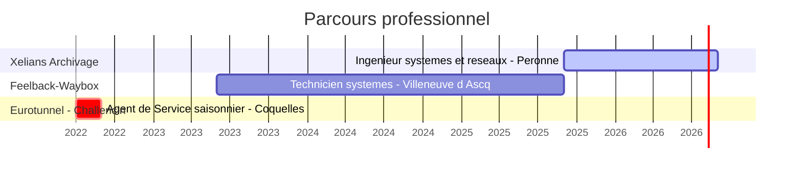
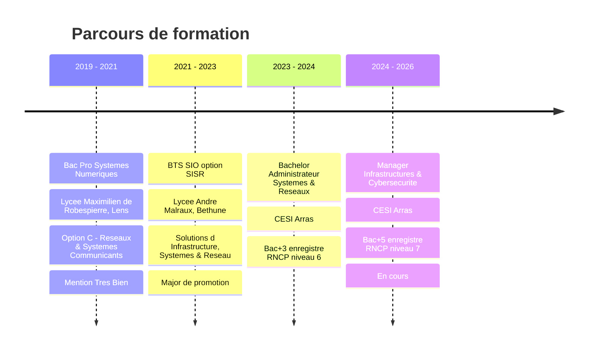

# Simon LACHERY

**Ingénieur Systèmes & Réseaux** · Hauts-de-France

---

Je suis en formation **Manager en Infrastructures et Cybersécurité des Systèmes d'Information** (Bac+5) au CESI d'Arras, tout en travaillant en alternance comme **Ingénieur Systèmes et Réseaux** au sein de la société **Xelians**.

J'ai précédemment obtenu un **BTS SIO** (Bac+2) et une **Licence ASR** (Bac+3). Mon cursus m'a permis de me spécialiser dans les infrastructures système et réseau, et je m'efforce constamment d'améliorer mes compétences dans ces domaines variés.

Je vous invite à consulter mon profil pour découvrir davantage sur mon parcours, mes expériences et mes compétences.

---

## Compétences

<table>
  <tr>
    <td valign="top"><b>OS</b></td>
    <td>
      
      
      
      
    </td>
  </tr>
  <tr>
    <td valign="top"><b>Virtualisation</b></td>
    <td>
      
      
      
      
    </td>
  </tr>
  <tr>
    <td valign="top"><b>Administration</b></td>
    <td>
      
      
      
      
      
      
      
      
      
      
    </td>
  </tr>
  <tr>
    <td valign="top"><b>Sauvegarde</b></td>
    <td>
      
      
      
    </td>
  </tr>
  <tr>
    <td valign="top"><b>Équipements&nbsp;réseau</b></td>
    <td>
      
      
      
      
      
    </td>
  </tr>
  <tr>
    <td valign="top"><b>Services&nbsp;&&nbsp;Protocoles</b></td>
    <td>
      
      
      
      
      
      
      
      
    </td>
  </tr>
  <tr>
    <td valign="top"><b>Sécurité</b></td>
    <td>
      
      
      
      
      
    </td>
  </tr>
  <tr>
    <td valign="top"><b>Supervision</b></td>
    <td>
      
      
      
    </td>
  </tr>
  <tr>
    <td valign="top"><b>SysOps&nbsp;&&nbsp;Outils</b></td>
    <td>
      
      
      
      
      
      
      
      
    </td>
  </tr>
  <tr>
    <td valign="top"><b>Scripting</b></td>
    <td>
      
      
      
      
      
      
      
    </td>
  </tr>
  <tr>
    <td valign="top"><b>Conteneurisation</b></td>
    <td>
      
      
    </td>
  </tr>
  <tr>
    <td valign="top"><b>CI/CD</b></td>
    <td>
      
      
    </td>
  </tr>
</table>

---

## Expériences

---

## Formation

---

## Stats GitHub

  
  

